## What is JWPubLib?

JWPubLib is a collection of **Public Domain** Bible reference works and study projects packaged as *.jwpub* archives that can be added to the JW Library app[^1] — as one would supplement/complement a physical library (personal or in a Kingdom Hall) with an atlas, dictionaries, and other such secular publications. Or, if you prefer a food analogy, these “unofficial” publications are not the meal, but the non-essential extras, like napkins and candles, or like the hot-sauce that some take with them to a restaurant :-)

The material is **not copyrighted** and is packaged with open-source tools and technologies. ([Mt 7:7](https://www.jw.org/finder?bible=40007007))

Gallery
 

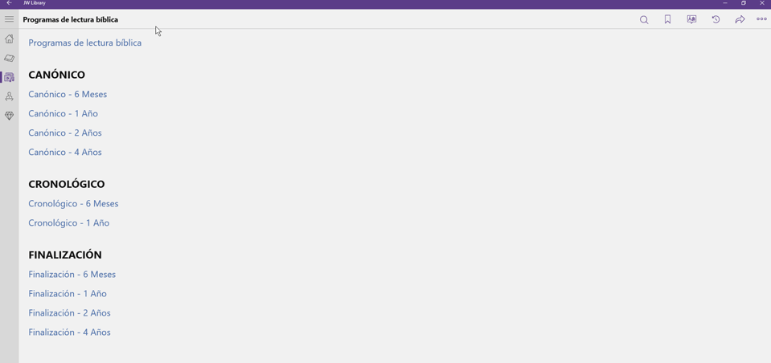 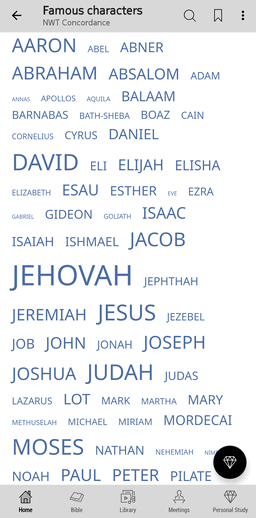 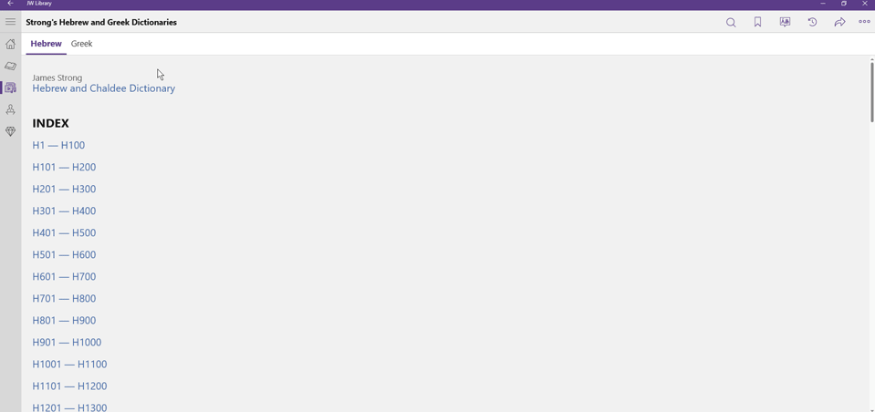 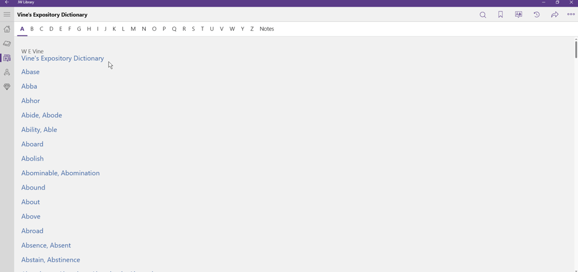 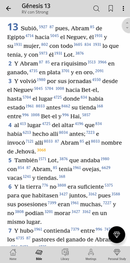
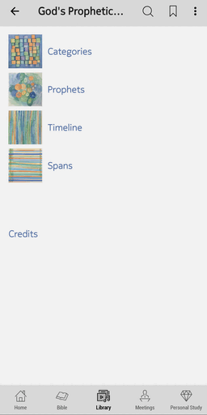 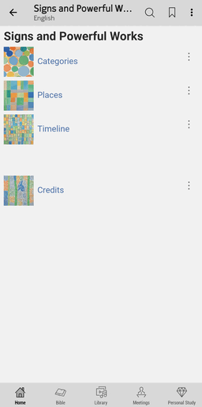 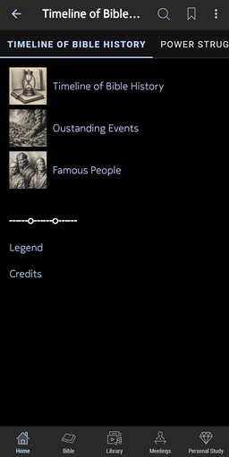 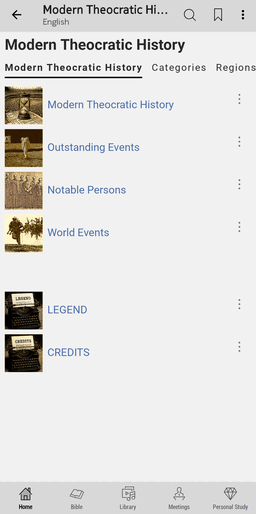 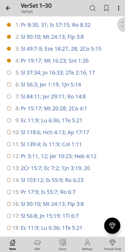
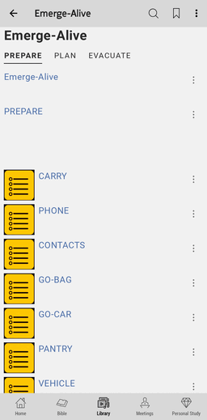 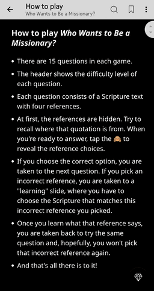 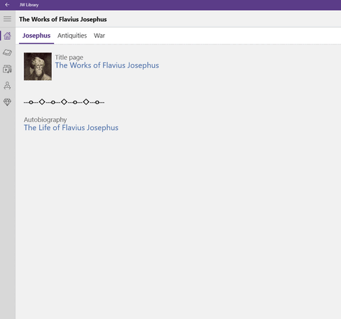
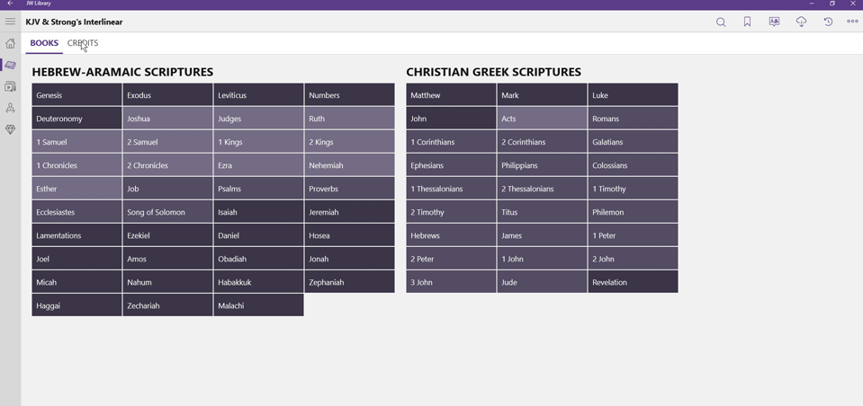

 

[^1]: [JW Library](https://www.jw.org/en/online-help/jw-library/) is a registered trademark of *Watch Tower Bible and Tract Society of Pennsylvania*
