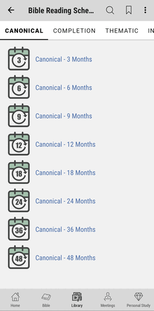
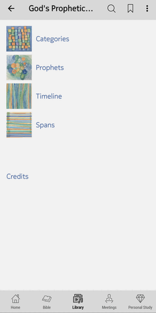
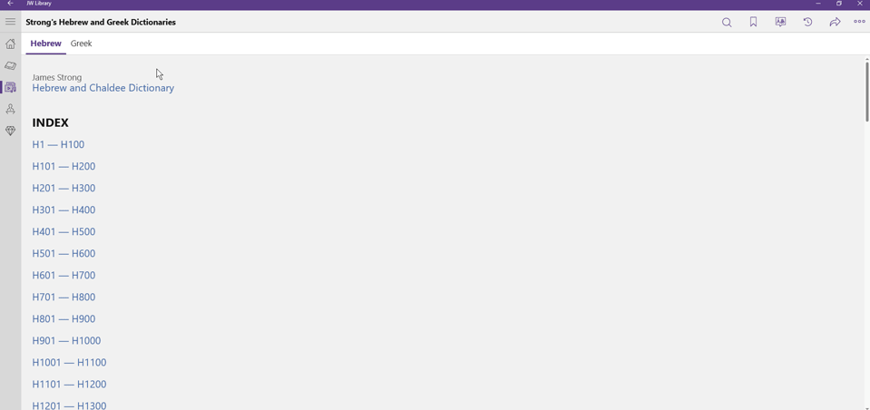
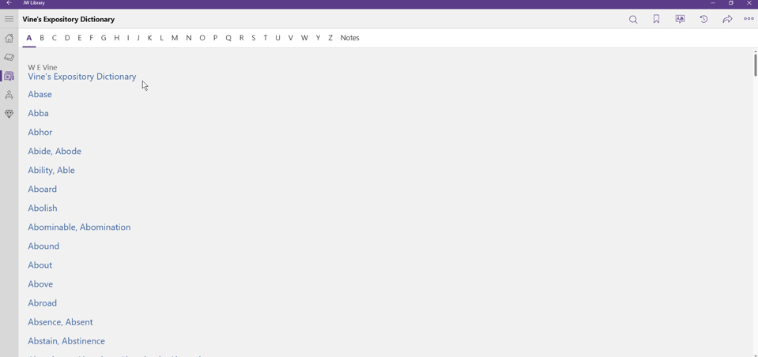
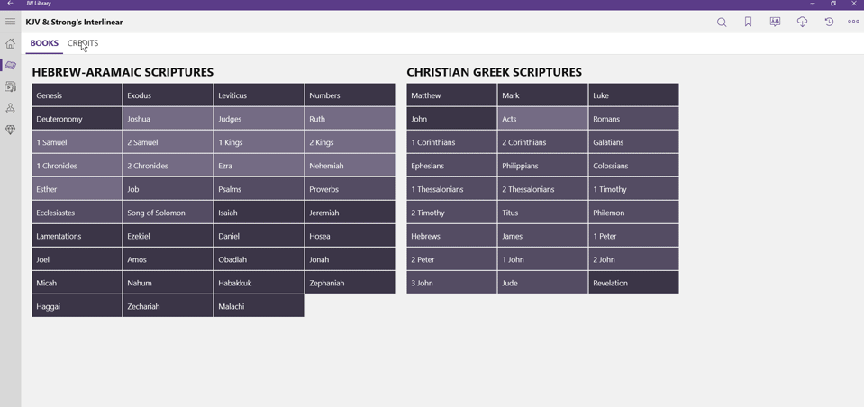
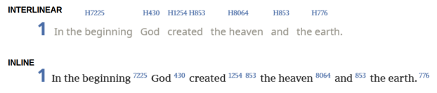

 

# JWPubLib

This is a collection of Bible reference works and study projects packaged as *.jwpub* archives that can be added to the **JW Library** app[^1] - as one would supplement/complement a physical library (personal or in a Kingdom Hall) with an atlas, dictionaries, and other such secular publications.

The material provided here is **not copyrighted**; it is in the **Public Domain**. However, the production code/methods **cannot be shared**; the same goes for the source material. Thanks for understanding and for not insisting.

## How to Install

You can simply click on the link to the publication (or on the language-specific link). Or, if you want to install on a mobile device, you can click the QR link to see the code on the screen and scan it. Once the archive is downloaded, **tap/double-click the downloaded file** (if asked, "Open with..." the JW Library app). It will appear in the **"Guidelines"** section (*Library* → *DOWNLOADED* → *Guidelines*).

These publications **will not update** automatically. You will need to check for updates here, and if a newer release is available, download and install it the same way.

____
____
## Bookshelf
* [Bible Reading Schedules](#bible-reading-schedules-)
* [God's Prophetic Word](#gods-prophetic-word-)
* [Timeline of Bible History](#timeline-of-bible-history-)
* [Who Wants to Be a Missionary?](#who-wants-to-be-a-missionary-)   **UPDATED**
* [Strong's *Hebrew and Chaldee Dictionary* and *Greek Dictionary of the New Testament*](#strongs-hebrew-and-chaldee-dictionary-and-greek-dictionary-of-the-new-testament-)
* [Vine's *Expository Dictionary of New Testament Words*](#vines-expository-dictionary-of-new-testament-words-)
* [*KJV* and *Strong's* Inline/Interlinear](#kjv-and-strongs-inlineinterlinear-)
* [*Faith on the March*](#faith-on-the-march-)
* [*The Works of Flavius Josephus*](#the-works-of-flavius-josephus-)

____
## Bible Reading Schedules [⇧](#bookshelf)

* **Description**: Personal project with Bible reading schedules of varying sequences and lengths
* **Latest release**: *BRS_4.0.jwpub* - [Cebuano](https://github.com/erykjj/jwpublib/releases/download/BRS_4.0/BRS_4.0_CV.jwpub) ([QR](https://api.qrserver.com/v1/create-qr-code/?size=150x150&data=https://github.com/erykjj/jwpublib/releases/download/BRS_4.0/BRS_4.0_CV.jwpub)), [Chinese (simplified)](https://github.com/erykjj/jwpublib/releases/download/BRS_4.0/BRS_4.0_CHS.jwpub) ([QR](https://api.qrserver.com/v1/create-qr-code/?size=150x150&data=https://github.com/erykjj/jwpublib/releases/download/BRS_4.0/BRS_4.0_CHS.jwpub)), [Danish](https://github.com/erykjj/jwpublib/releases/download/BRS_4.0/BRS_4.0_D.jwpub) ([QR](https://api.qrserver.com/v1/create-qr-code/?size=150x150&data=https://github.com/erykjj/jwpublib/releases/download/BRS_4.0/BRS_4.0_D.jwpub)), [Dutch](https://github.com/erykjj/jwpublib/releases/download/BRS_4.0/BRS_4.0_O.jwpub) ([QR](https://api.qrserver.com/v1/create-qr-code/?size=150x150&data=https://github.com/erykjj/jwpublib/releases/download/BRS_4.0/BRS_4.0_O.jwpub)), [English](https://github.com/erykjj/jwpublib/releases/download/BRS_4.0/BRS_4.0_E.jwpub) ([QR](https://api.qrserver.com/v1/create-qr-code/?size=150x150&data=https://github.com/erykjj/jwpublib/releases/download/BRS_4.0/BRS_4.0_E.jwpub)), [French](https://github.com/erykjj/jwpublib/releases/download/BRS_4.0/BRS_4.0_F.jwpub) ([QR](https://api.qrserver.com/v1/create-qr-code/?size=150x150&data=https://github.com/erykjj/jwpublib/releases/download/BRS_4.0/BRS_4.0_F.jwpub)), [German](https://github.com/erykjj/jwpublib/releases/download/BRS_4.0/BRS_4.0_X.jwpub) ([QR](https://api.qrserver.com/v1/create-qr-code/?size=150x150&data=https://github.com/erykjj/jwpublib/releases/download/BRS_4.0/BRS_4.0_X.jwpub)), [Hungarian](https://github.com/erykjj/jwpublib/releases/download/BRS_4.0/BRS_4.0a_H.jwpub) ([QR](https://api.qrserver.com/v1/create-qr-code/?size=150x150&data=https://github.com/erykjj/jwpublib/releases/download/BRS_4.0/BRS_4.0a_H.jwpub)), [Italian](https://github.com/erykjj/jwpublib/releases/download/BRS_4.0/BRS_4.0a_I.jwpub) ([QR](https://api.qrserver.com/v1/create-qr-code/?size=150x150&data=https://github.com/erykjj/jwpublib/releases/download/BRS_4.0/BRS_4.0a_I.jwpub)), [Polish](https://github.com/erykjj/jwpublib/releases/download/BRS_4.0/BRS_4.0_P.jwpub) ([QR](https://api.qrserver.com/v1/create-qr-code/?size=150x150&data=https://github.com/erykjj/jwpublib/releases/download/BRS_4.0/BRS_4.0_P.jwpub)), [Portuguese](https://github.com/erykjj/jwpublib/releases/download/BRS_4.0/BRS_4.0_T.jwpub) ([QR](https://api.qrserver.com/v1/create-qr-code/?size=150x150&data=https://github.com/erykjj/jwpublib/releases/download/BRS_4.0/BRS_4.0_T.jwpub)), [Russian](https://github.com/erykjj/jwpublib/releases/download/BRS_4.0/BRS_4.0_U.jwpub) ([QR](https://api.qrserver.com/v1/create-qr-code/?size=150x150&data=https://github.com/erykjj/jwpublib/releases/download/BRS_4.0/BRS_4.0_U.jwpub)), [Spanish](https://github.com/erykjj/jwpublib/releases/download/BRS_4.0/BRS_4.0_S.jwpub) ([QR](https://api.qrserver.com/v1/create-qr-code/?size=150x150&data=https://github.com/erykjj/jwpublib/releases/download/BRS_4.0/BRS_4.0_S.jwpub)), [Swedish](https://github.com/erykjj/jwpublib/releases/download/BRS_4.0/BRS_4.0_Z.jwpub) ([QR](https://api.qrserver.com/v1/create-qr-code/?size=150x150&data=https://github.com/erykjj/jwpublib/releases/download/BRS_4.0/BRS_4.0_Z.jwpub)), [Tagalog](https://github.com/erykjj/jwpublib/releases/download/BRS_4.0/BRS_4.0_TG.jwpub) ([QR](https://api.qrserver.com/v1/create-qr-code/?size=150x150&data=https://github.com/erykjj/jwpublib/releases/download/BRS_4.0/BRS_4.0_TG.jwpub)), [Ukrainian](https://github.com/erykjj/jwpublib/releases/download/BRS_4.0/BRS_4.0_K.jwpub) ([QR](https://api.qrserver.com/v1/create-qr-code/?size=150x150&data=https://github.com/erykjj/jwpublib/releases/download/BRS_4.0/BRS_4.0_K.jwpub))
* **Released**: [2024-09-25](CHANGELOG.md/#brs_40---2024-09-25)
* **Note**: Please report any discrepancies in the chronological schedules
* **Traslations**: [Let me know](https://github.com/erykjj/jwpublib/issues/21) if you would like this in another language or if you notice any errors in the current translations.

____
## God's Prophetic Word [⇧](#bookshelf)

* **Description**: A compilation of Bible prophecies *with fulfillment registered in the Scriptures*
* **Latest release**: *GPW_4.0.jwpub* - [Cebuano](https://github.com/erykjj/jwpublib/releases/download/GPW_4.0/GPW_4.0_CV.jwpub) ([QR](https://api.qrserver.com/v1/create-qr-code/?size=150x150&data=https://github.com/erykjj/jwpublib/releases/download/GPW_4.0/GPW_4.0_CV.jwpub)), [Danish](https://github.com/erykjj/jwpublib/releases/download/GPW_4.0/GPW_4.0_D.jwpub) ([QR](https://api.qrserver.com/v1/create-qr-code/?size=150x150&data=https://github.com/erykjj/jwpublib/releases/download/GPW_4.0/GPW_4.0_D.jwpub)), [English](https://github.com/erykjj/jwpublib/releases/download/GPW_4.0/GPW_4.0_E.jwpub) ([QR](https://api.qrserver.com/v1/create-qr-code/?size=150x150&data=https://github.com/erykjj/jwpublib/releases/download/GPW_4.0/GPW_4.0_E.jwpub)), [Polish](https://github.com/erykjj/jwpublib/releases/download/GPW_4.0/GPW_4.0_P.jwpub) ([QR](https://api.qrserver.com/v1/create-qr-code/?size=150x150&data=https://github.com/erykjj/jwpublib/releases/download/GPW_4.0/GPW_4.0_P.jwpub)), [Portuguese](https://github.com/erykjj/jwpublib/releases/download/GPW_4.0/GPW_4.0_T.jwpub) ([QR](https://api.qrserver.com/v1/create-qr-code/?size=150x150&data=https://github.com/erykjj/jwpublib/releases/download/GPW_4.0/GPW_4.0_T.jwpub)), [Spanish](https://github.com/erykjj/jwpublib/releases/download/GPW_4.0/GPW_4.0_S.jwpub) ([QR](https://api.qrserver.com/v1/create-qr-code/?size=150x150&data=https://github.com/erykjj/jwpublib/releases/download/GPW_4.0/GPW_4.0_S.jwpub)),  [Swedish](https://github.com/erykjj/jwpublib/releases/download/GPW_4.0/GPW_4.0_Z.jwpub) ([QR](https://api.qrserver.com/v1/create-qr-code/?size=150x150&data=https://github.com/erykjj/jwpublib/releases/download/GPW_4.0/GPW_4.0_Z.jwpub)), [Ukrainian](https://github.com/erykjj/jwpublib/releases/download/GPW_4.0/GPW_4.0_K.jwpub) ([QR](https://api.qrserver.com/v1/create-qr-code/?size=150x150&data=https://github.com/erykjj/jwpublib/releases/download/GPW_4.0/GPW_4.0_K.jwpub))
* **Released**: [2024-07-21](CHANGELOG.md/#gpw_40---2024-07-21)
* **Note**: Ensure your JW Library app is up-to-date. If you spot any discrepancies or can suggest prophecies that have not been included and should be, please do so [here](https://github.com/erykjj/jwpublib/issues/45)
* **Traslations**: If interested, please [let me know](https://github.com/erykjj/jwpublib/issues/42)

____
## Timeline of Bible History [⇧](#bookshelf)

* **Description**: A chronological compilation of events (mostly) related to Bible history
* **Latest release**: *TBH_9.0.jwpub* - [Danish](https://github.com/erykjj/jwpublib/releases/download/TBH_9.0/TBH_9.0_D.jwpub) ([QR](https://api.qrserver.com/v1/create-qr-code/?size=150x150&data=https://github.com/erykjj/jwpublib/releases/download/TBH_9.0/TBH_9.0_D.jwpub)), [English](https://github.com/erykjj/jwpublib/releases/download/TBH_9.0/TBH_9.0_E.jwpub) ([QR](https://api.qrserver.com/v1/create-qr-code/?size=150x150&data=https://github.com/erykjj/jwpublib/releases/download/TBH_9.0/TBH_9.0_E.jwpub)), [French](https://github.com/erykjj/jwpublib/releases/download/TBH_9.0/TBH_9.0_F.jwpub) ([QR](https://api.qrserver.com/v1/create-qr-code/?size=150x150&data=https://github.com/erykjj/jwpublib/releases/download/TBH_9.0/TBH_9.0_F.jwpub)), [Spanish](https://github.com/erykjj/jwpublib/releases/download/TBH_9.0/TBH_9.0_S.jwpub) ([QR](https://api.qrserver.com/v1/create-qr-code/?size=150x150&data=https://github.com/erykjj/jwpublib/releases/download/TBH_9.0/TBH_9.0_S.jwpub)), [Ukrainian](https://github.com/erykjj/jwpublib/releases/download/TBH_9.0/TBH_9.0_K.jwpub) ([QR](https://api.qrserver.com/v1/create-qr-code/?size=150x150&data=https://github.com/erykjj/jwpublib/releases/download/TBH_9.0/TBH_9.0_K.jwpub))
* **Released**: [2024-08-29](CHANGELOG.md/#tbh_90---2024-08-29)
* **Note**: Tapping on a year in any of the thematic timelines, will give you an overview of the whole year in the side/study pane; tapping on a kindgom or region tag will take you to the corresponding thematic timeline; and tapping the name of a Hebrew month, will point you to more information. Keep in mind that if you annotate in any way and a future release includes additional historical events, your notes and highlights will no longer match up
* **Traslations**: If interested, please [let me know](https://github.com/erykjj/jwpublib/issues/37)

____
## Who Wants to Be a Missionary? [⇧](#bookshelf)

* **Description**: A quiz game to test your knowledge of the Scriptures — and to improve it while having fun
* **Latest release**: *BaM_3.1.jwpub* - [Cebuano](https://github.com/erykjj/jwpublib/releases/download/BaM_3.1/BaM_3.1_CV.jwpub) ([QR](https://api.qrserver.com/v1/create-qr-code/?size=150x150&data=https://github.com/erykjj/jwpublib/releases/download/BaM_3.1/BaM_3.1_CV.jwpub)), [Chinese (simplified)](https://github.com/erykjj/jwpublib/releases/download/BaM_3.1/BaM_3.1_CHS.jwpub) ([QR](https://api.qrserver.com/v1/create-qr-code/?size=150x150&data=https://github.com/erykjj/jwpublib/releases/download/BaM_3.1/BaM_3.1_CHS.jwpub)), [Danish](https://github.com/erykjj/jwpublib/releases/download/BaM_3.1/BaM_3.1_D.jwpub) ([QR](https://api.qrserver.com/v1/create-qr-code/?size=150x150&data=https://github.com/erykjj/jwpublib/releases/download/BaM_3.1/BaM_3.1_D.jwpub)), [English](https://github.com/erykjj/jwpublib/releases/download/BaM_3.1/BaM_3.1_E.jwpub) ([QR](https://api.qrserver.com/v1/create-qr-code/?size=150x150&data=https://github.com/erykjj/jwpublib/releases/download/BaM_3.1/BaM_3.1_E.jwpub)), [French](https://github.com/erykjj/jwpublib/releases/download/BaM_3.1/BaM_3.1_F.jwpub) ([QR](https://api.qrserver.com/v1/create-qr-code/?size=150x150&data=https://github.com/erykjj/jwpublib/releases/download/BaM_3.1/BaM_3.1_F.jwpub)), [Italian](https://github.com/erykjj/jwpublib/releases/download/BaM_3.1/BaM_3.1_I.jwpub) ([QR](https://api.qrserver.com/v1/create-qr-code/?size=150x150&data=https://github.com/erykjj/jwpublib/releases/download/BaM_3.1/BaM_3.1_I.jwpub)), [Polish](https://github.com/erykjj/jwpublib/releases/download/BaM_3.1/BaM_3.1_P.jwpub) ([QR](https://api.qrserver.com/v1/create-qr-code/?size=150x150&data=https://github.com/erykjj/jwpublib/releases/download/BaM_3.1/BaM_3.1_P.jwpub)), [Portuguese](https://github.com/erykjj/jwpublib/releases/download/BaM_3.1/BaM_3.1_T.jwpub) ([QR](https://api.qrserver.com/v1/create-qr-code/?size=150x150&data=https://github.com/erykjj/jwpublib/releases/download/BaM_3.1/BaM_3.1_T.jwpub)), [Russian](https://github.com/erykjj/jwpublib/releases/download/BaM_3.1/BaM_3.1_U.jwpub) ([QR](https://api.qrserver.com/v1/create-qr-code/?size=150x150&data=https://github.com/erykjj/jwpublib/releases/download/BaM_3.1/BaM_3.1_U.jwpub)), [Spanish](https://github.com/erykjj/jwpublib/releases/download/BaM_3.1/BaM_3.1_S.jwpub) ([QR](https://api.qrserver.com/v1/create-qr-code/?size=150x150&data=https://github.com/erykjj/jwpublib/releases/download/BaM_3.1/BaM_3.1_S.jwpub)), [Swedish](https://github.com/erykjj/jwpublib/releases/download/BaM_3.1/BaM_3.1_Z.jwpub) ([QR](https://api.qrserver.com/v1/create-qr-code/?size=150x150&data=https://github.com/erykjj/jwpublib/releases/download/BaM_3.1/BaM_3.1_Z.jwpub)), [Ukrainian](https://github.com/erykjj/jwpublib/releases/download/BaM_3.1/BaM_3.1_K.jwpub) ([QR](https://api.qrserver.com/v1/create-qr-code/?size=150x150&data=https://github.com/erykjj/jwpublib/releases/download/BaM_3.1/BaM_3.1_K.jwpub))
* **Released**: [2024-10-06](CHANGELOG.md/#bam_31---2024-10-06)
* **Note**: Ensure your JW Library app is up-to-date
* **Traslations**: If interested, please [let me know](https://github.com/erykjj/jwpublib/issues/47)

____
## Strong's *Hebrew and Chaldee Dictionary* and *Greek Dictionary of the New Testament* [⇧](#bookshelf)

* **Description**: Hebrew and Greek dictionaries and concordance (with back-links to [*Vine's*](README.md/#vines-expository-dictionary-of-new-testament-words))
* **Latest release**: [*Str_4.0.jwpub*](https://github.com/erykjj/jwpublib/releases/download/Str_4.0/Str_4.0.jwpub) ([QR](https://api.qrserver.com/v1/create-qr-code/?size=150x150&data=https://github.com/erykjj/jwpublib/releases/download/Str_4.0/Str_4.0.jwpub))
* **Released**: [2024-06-30](CHANGELOG.md/#str_40---2024-06-30)

____
## Vine's *Expository Dictionary of New Testament Words* [⇧](#bookshelf)

* **Description**: More extensive Greek dictionary (with links to [*Strong's*](README.md/#strongs-hebrew-and-chaldee-dictionary--strongs-greek-dictionary-of-the-new-testament))
* **Latest release**: [*VED_4.0.jwpub*](https://github.com/erykjj/jwpublib/releases/download/VED_4.0/VED_4.0.jwpub) ([QR](https://api.qrserver.com/v1/create-qr-code/?size=150x150&data=https://github.com/erykjj/jwpublib/releases/download/VED_4.0/VED_4.0.jwpub))
* **Released**: [2024-06-30](CHANGELOG.md/#ved_40---2024-06-30)

____
## *KJV* and *Strong's* Inline/Interlinear [⇧](#bookshelf)

* **Description**: *King James Version* with inline/interlinear links to [*Strong's*](README.md/#strongs-hebrew-and-chaldee-dictionary--strongs-greek-dictionary-of-the-new-testament)
* **Latest releases**: [*KJS_4.0-inline.jwpub*](https://github.com/erykjj/jwpublib/releases/download/KJS_4.0/KJS_4.0-inline.jwpub) ([QR](https://api.qrserver.com/v1/create-qr-code/?size=150x150&data=https://github.com/erykjj/jwpublib/releases/download/KJS_4.0/KJS_4.0-inline.jwpub)) & [*KJS_4.0-interlinear.jwpub*](https://github.com/erykjj/jwpublib/releases/download/KJS_4.0/KJS_4.0-interlinear.jwpub) ([QR](https://api.qrserver.com/v1/create-qr-code/?size=150x150&data=https://github.com/erykjj/jwpublib/releases/download/KJS_4.0/KJS_4.0-interlinear.jwpub))
* **Released**: [2024-06-30](CHANGELOG.md/#kjs_40---2024-06-30)
* **Note**: The *interlinear* version needs to replace the *Kingdom Interlinear*, so if you have that installed, you'll need to remove it: *Bible* → *Languages* → *Delete*. The *inline* version can co-exist with the *Kingdom Interlinear* or the *KJS-interlinear*. Add to your Bible comparison selection in the side pane for quick lookup of words in Strong's dictionaries

____
## *Faith on the March* [⇧](#bookshelf)

* **Description**: By A. H. Macmillan; originally published in 1957
* **Latest release**: [*Fth_2.0.jwpub*](https://github.com/erykjj/jwpublib/releases/download/Fth_2.0/Fth_2.0.jwpub) ([QR](https://api.qrserver.com/v1/create-qr-code/?size=150x150&data=https://github.com/erykjj/jwpublib/releases/download/Fth_2.0/Fth_2.0.jwpub))
* **Released**: [2024-09-19](CHANGELOG.md/#fth_20---2024-09-19)
* **Note**: Please report any errors [here](https://github.com/erykjj/jwpublib/issues/54)

____
## *The Works of Flavius Josephus* [⇧](#bookshelf)

* **Description**: *Antiquities of the Jews*, *Jewish War* and *The Life of Flavius Josephus*
* **Latest release**: [*Jph_1.0.jwpub*](https://github.com/erykjj/jwpublib/releases/download/Jph_1.0/Jph_1.0.jwpub) ([QR](https://api.qrserver.com/v1/create-qr-code/?size=150x150&data=https://github.com/erykjj/jwpublib/releases/download/Jph_1.0/Jph_1.0.jwpub))
* **Released**: [2024-03-13](CHANGELOG.md/#jph_10---2024-03-13)

____
____
## Feedback, etc.

Feel free to [get in touch](https://github.com/erykjj/jwpublib/issues) and post any issues, suggestions, ideas, etc.

My other *JW Library* project: [**JWLManager**](https://github.com/erykjj/jwlmanager)

____
⠗⠑⠑⠝⠊⠛⠝⠑

#### Footnotes:
[^1]: [JW Library](https://www.jw.org/en/online-help/jw-library/) is a registered trademark of *Watch Tower Bible and Tract Society of Pennsylvania*
