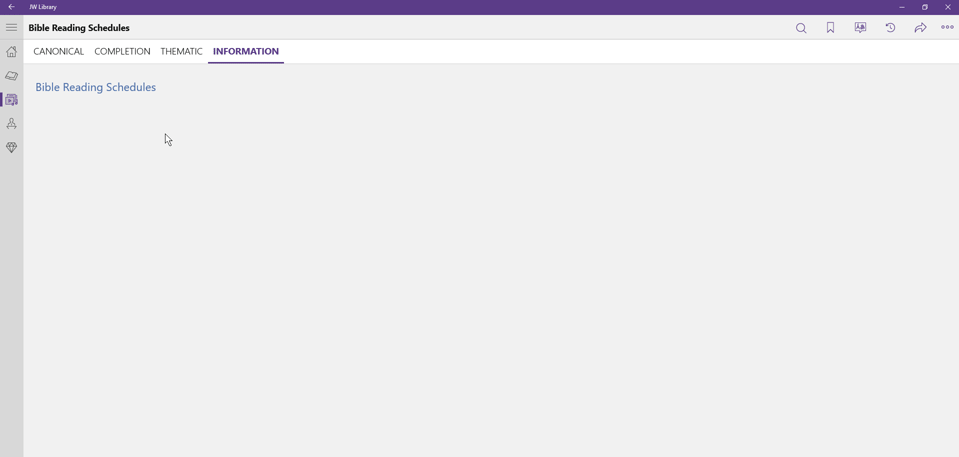

# JWPubLib

This is a collection of reference works packaged as *.jwpub* archives that can be added to the **JW Library** app[^1] by simply downloading the "Latest release" and **tapping/double-clicking the downloaded file** (on Windows, you can also drag and drop the file into the "Library" section of the JW Library app). It will appear in the "Guidelines" section (*Library* → *DOWNLOADED* tab → *Guidelines* section).

The material provided here is ***not* copyrighted**; it is in the **Public Domain**. However, the production code/methods *cannot* be shared; the same goes for the source material — you can find it all online. Thanks for understanding and for not insisting.

[UPCOMING CHANGES](CHANGELOG.md#unreleased)

____
____
## Bible Reading Schedules

* **Description**: Personal project with Bible reading schedules of varying sequences and lengths
* **Latest release**: *BRS_2.0.jwpub* - [Cebuano](https://github.com/erykjj/jwpublib/releases/download/BRS_2.0/BRS_2.0_CV.jwpub), [Chinese (simplified)](https://github.com/erykjj/jwpublib/releases/download/BRS_2.0/BRS_2.0_CHS.jwpub), [Dutch](https://github.com/erykjj/jwpublib/releases/download/BRS_2.0/BRS_2.0_O.jwpub), [English](https://github.com/erykjj/jwpublib/releases/download/BRS_2.0/BRS_2.0_E.jwpub), [French](https://github.com/erykjj/jwpublib/releases/download/BRS_2.0/BRS_2.0_F.jwpub), [German](https://github.com/erykjj/jwpublib/releases/download/BRS_2.0/BRS_2.0_X.jwpub), [Italian](https://github.com/erykjj/jwpublib/releases/download/BRS_2.0/BRS_2.0a_I.jwpub), [Polish](https://github.com/erykjj/jwpublib/releases/download/BRS_2.0/BRS_2.0_P.jwpub), [Portuguese](https://github.com/erykjj/jwpublib/releases/download/BRS_2.0/BRS_2.0_T.jwpub), [Russian](https://github.com/erykjj/jwpublib/releases/download/BRS_2.0/BRS_2.0_U.jwpub), [Spanish](https://github.com/erykjj/jwpublib/releases/download/BRS_2.0/BRS_2.0_S.jwpub), [Tagalog](https://github.com/erykjj/jwpublib/releases/download/BRS_2.0/BRS_2.0_TG.jwpub)
* **Released**: [2023-07-05](CHANGELOG.md/#brs_20---2023-07-05)
* **Note**: Let me know if you would like this in another language or if you notice any errors in the current translations. See [here.](https://github.com/erykjj/jwpublib/blob/master/BRS-Translation.md)

____
## Strong's *Hebrew and Chaldee Dictionary* and *Greek Dictionary of the New Testament*

* **Description**: Hebrew and Greek dictionaries and concordance (with back-links to [*Vine's*](README.md/#vines-expository-dictionary-of-new-testament-words))
* **Latest release**: [*Str_2.1.jwpub*](https://github.com/erykjj/jwpublib/releases/download/Str_2.1/Str_2.1.jwpub)
* **Released**: [2023-11-21](CHANGELOG.md/#str_21---2023-11-21)

____
## Vine's *Expository Dictionary of New Testament Words*

* **Description**: More extensive Greek dictionary (with links to [*Strong's*](README.md/#strongs-hebrew-and-chaldee-dictionary--strongs-greek-dictionary-of-the-new-testament))
* **Latest release**: [*VED_2.1.jwpub*](https://github.com/erykjj/jwpublib/releases/download/VED_2.1/VED_2.1.jwpub)
* **Released**: [2023-11-21](CHANGELOG.md/#ved_21---2023-11-21)

____
## *KJV* and *Strong's* interlinear

* **Description**: *King James Version* with interlinear links to [*Strong's*](README.md/#strongs-hebrew-and-chaldee-dictionary--strongs-greek-dictionary-of-the-new-testament)
* **Latest release**: [*KJS_1.3.jwpub*](https://github.com/erykjj/jwpublib/releases/download/KJS_1.3/KJS_1.3.jwpub)
* **Released**: [2023-06-08](CHANGELOG.md/#kjs_13---2023-06-08)
* **Note**: This needs to replace the *Kingdom Interlinear*, so if you have that installed, you'll need to remove it (Bible → Languages → Delete)

____
____
## Feedback

Feel free to [get in touch](https://github.com/erykjj/jwpublib/issues) and post any issues, suggestions, ideas, etc.

[^1]: [JW Library](https://www.jw.org/en/online-help/jw-library/) is a registered trademark of *Watch Tower Bible and Tract Society of Pennsylvania*.
