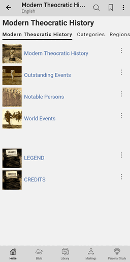
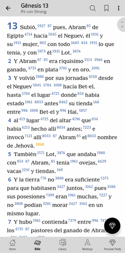

# **This Public Domain library is closing**
Thank you all for your support (Heb 13:16)

____
____

 

# JWPubLib

This is a collection of Bible reference works and study projects packaged as *.jwpub* archives that can be added to the **JW Library** app[^1] - as one would supplement/complement a physical library (personal or in a Kingdom Hall) with an atlas, dictionaries, and other such secular publications.

The material provided here is **not copyrighted**; it is in the **Public Domain**. However, the production code/methods **cannot be shared**; the same goes for the source material. Thanks for understanding and for not insisting.

## How to Install

You can simply click on the link to the publication (or on the language-specific link). Or, if you want to install on a mobile device, you can click the QR icon  to see the code on the screen and scan it. Once the archive is downloaded, **tap/double-click the downloaded file** (if asked, "Open with..." the JW Library app). It will appear in the **"Guidelines"** section (*Library* → *DOWNLOADED* → *Guidelines*).

These "publications" **will not update automatically**. You will need to check for updates here, and if a newer release is available, download and install it the same way.

____
____
## Bookshelf

### Bible reading and study
* [Bible Reading Schedules](#bible-reading-schedules-)
* [VerSet](#verset-)
### Bibles and dictionaries
* [NWT Concordance](#nwt-concordance-)
* [Strong's *Hebrew and Chaldee Dictionary* and *Greek Dictionary of the New Testament*](#strongs-hebrew-and-chaldee-dictionary-and-greek-dictionary-of-the-new-testament-)
* [Vine's *Expository Dictionary of New Testament Words*](#vines-expository-dictionary-of-new-testament-words-)
* [*KJV* with *Strong's* Inline/Interlinear](#kjv-with-strongs-inlineinterlinear-)
* [*RV* con números de *Strong*](#rv-con-números-de-strong-)
### Research projects
* [God's Prophetic Word](#gods-prophetic-word-)
* [Signs and Powerful Works](#signs-and-powerful-works-)
* [Timeline of Bible History](#timeline-of-bible-history-)
* [Modern Theocratic History](#modern-theocratic-history-)
### Other
* [Emerge-Alive](#emerge-alive-)
* [Who Wants to Be a Missionary?](#who-wants-to-be-a-missionary-)
* [*Faith on the March*](#faith-on-the-march-)
* [*The Works of Flavius Josephus*](#the-works-of-flavius-josephus-)

____
____
## Bible Reading Schedules [⇧](#bookshelf)

* **Description**: Bible reading schedules of varying sequences and lengths
* **[Latest release](https://github.com/erykjj/jwpublib/releases/tag/BRS_5.0)**: *BRS_5.0* — [Cebuano](https://github.com/erykjj/jwpublib/releases/download/BRS_5.0/BRS_5.0_CV.jwpub)&nbsp;, [Chinese (simplified)](https://github.com/erykjj/jwpublib/releases/download/BRS_5.0/BRS_5.0_CHS.jwpub)&nbsp;, [Danish](https://github.com/erykjj/jwpublib/releases/download/BRS_5.0/BRS_5.0_D.jwpub)&nbsp;, [Dutch](https://github.com/erykjj/jwpublib/releases/download/BRS_5.0/BRS_5.0_O.jwpub)&nbsp;, [English](https://github.com/erykjj/jwpublib/releases/download/BRS_5.0/BRS_5.0_E.jwpub)&nbsp;, [Ewe](https://github.com/erykjj/jwpublib/releases/download/BRS_5.0/BRS_5.0_EW.jwpub)&nbsp;, [French](https://github.com/erykjj/jwpublib/releases/download/BRS_5.0/BRS_5.0_F.jwpub)&nbsp;, [German](https://github.com/erykjj/jwpublib/releases/download/BRS_5.0/BRS_5.0_X.jwpub)&nbsp;, [Hungarian](https://github.com/erykjj/jwpublib/releases/download/BRS_5.0/BRS_5.0_H.jwpub)&nbsp;, [Indonesian](https://github.com/erykjj/jwpublib/releases/download/BRS_5.0/BRS_5.0_IN.jwpub)&nbsp;, [Italian](https://github.com/erykjj/jwpublib/releases/download/BRS_5.0/BRS_5.0_I.jwpub)&nbsp;, [Korean](https://github.com/erykjj/jwpublib/releases/download/BRS_5.0/BRS_5.0_KO.jwpub)&nbsp;, [Polish](https://github.com/erykjj/jwpublib/releases/download/BRS_5.0/BRS_5.0_P.jwpub)&nbsp;, [Portuguese](https://github.com/erykjj/jwpublib/releases/download/BRS_5.0/BRS_5.0_T.jwpub)&nbsp;, [Romanian](https://github.com/erykjj/jwpublib/releases/download/BRS_5.0/BRS_5.0_M.jwpub)&nbsp;,[Russian](https://github.com/erykjj/jwpublib/releases/download/BRS_5.0/BRS_5.0_U.jwpub)&nbsp;, [Spanish](https://github.com/erykjj/jwpublib/releases/download/BRS_5.0/BRS_5.0_S.jwpub)&nbsp;, [Swedish](https://github.com/erykjj/jwpublib/releases/download/BRS_5.0/BRS_5.0_Z.jwpub)&nbsp;, [Tagalog](https://github.com/erykjj/jwpublib/releases/download/BRS_5.0/BRS_5.0_TG.jwpub)&nbsp;, [Ukrainian](https://github.com/erykjj/jwpublib/releases/download/BRS_5.0/BRS_5.0_K.jwpub)&nbsp;
* **Released**: [2024-12-21](CHANGELOG.md/#brs_50---2024-12-21)
* **Traslations**: [Let me know](https://github.com/erykjj/jwpublib/discussions/64) if you would like this in another language or if you notice any errors in the current translations

____
## Emerge-Alive [⇧](#bookshelf)

* **Description**: Emergency preparedness manual
* **[Latest release](https://github.com/erykjj/jwpublib/releases/tag/E-A_2.2)**: *E-A_2.2* — [English](https://github.com/erykjj/jwpublib/releases/download/E-A_2.2/E-A_2.2_E.jwpub)&nbsp;, [Italian](https://github.com/erykjj/jwpublib/releases/download/E-A_2.2/E-A_2.2_I.jwpub)&nbsp;,[Polish](https://github.com/erykjj/jwpublib/releases/download/E-A_2.2/E-A_2.2a_P.jwpub)&nbsp;, [Ukrainian](https://github.com/erykjj/jwpublib/releases/download/E-A_2.2/E-A_2.2_K.jwpub)&nbsp;
* **Released**: [2025-06-04](CHANGELOG.md/#e-a_22---2025-06-04)
* **Note**: Please report any suggestions you may have [here](https://github.com/erykjj/jwpublib/discussions/70)
* **Traslations**: If interested, please [let me know](https://github.com/erykjj/jwpublib/discussions/73)

____
## God's Prophetic Word [⇧](#bookshelf)

* **Description**: A compilation of Bible prophecies *with fulfillment registered in the Scriptures*
* **[Latest release](https://github.com/erykjj/jwpublib/releases/tag/GPW_5.2)**: *GPW_5.2* — [Cebuano](https://github.com/erykjj/jwpublib/releases/download/GPW_5.2/GPW_5.2_CV.jwpub)&nbsp;, [Danish](https://github.com/erykjj/jwpublib/releases/download/GPW_5.2/GPW_5.2_D.jwpub)&nbsp;, [Dutch](https://github.com/erykjj/jwpublib/releases/download/GPW_5.2/GPW_5.2_O.jwpub)&nbsp;, [English](https://github.com/erykjj/jwpublib/releases/download/GPW_5.2/GPW_5.2_E.jwpub)&nbsp;, [Italian](https://github.com/erykjj/jwpublib/releases/download/GPW_5.2/GPW_5.2_I.jwpub)&nbsp;, [Polish](https://github.com/erykjj/jwpublib/releases/download/GPW_5.2/GPW_5.2b_P.jwpub)&nbsp;, [Portuguese](https://github.com/erykjj/jwpublib/releases/download/GPW_5.2/GPW_5.2_T.jwpub)&nbsp;, [Spanish](https://github.com/erykjj/jwpublib/releases/download/GPW_5.2/GPW_5.2_S.jwpub)&nbsp;,  [Swedish](https://github.com/erykjj/jwpublib/releases/download/GPW_5.2/GPW_5.2_Z.jwpub)&nbsp;, [Ukrainian](https://github.com/erykjj/jwpublib/releases/download/GPW_5.2/GPW_5.2_K.jwpub)&nbsp;
* **Released**: [2025-05-20](CHANGELOG.md/#gpw_52---2025-05-20)
* **Note**: If you spot any discrepancies or can suggest prophecies that have not been included and should be, please do so [here](https://github.com/erykjj/jwpublib/discussions/66)
* **Traslations**: If interested, please [let me know](https://github.com/erykjj/jwpublib/discussions/66)

____
## Signs and Powerful Works [⇧](#bookshelf)

* **Description**: A compilation of miracles performed by Jesus Christ and others - project idea and research by Victor
* **[Latest release](https://github.com/erykjj/jwpublib/releases/tag/SPW_2.0)**: *SPW_2.0* — [English](https://github.com/erykjj/jwpublib/releases/download/SPW_2.0/SPW_2.0_E.jwpub)&nbsp;, [Portuguese](https://github.com/erykjj/jwpublib/releases/download/SPW_2.0/SPW_2.0_T.jwpub)&nbsp;, [Spanish](https://github.com/erykjj/jwpublib/releases/download/SPW_2.0/SPW_2.0_S.jwpub)&nbsp;
* **Released**: [2025-06-16](CHANGELOG.md/#spw_20---2025-06-16)
* **Note**: If you spot any discrepancies or can suggest miracles that have not been included and should be, please do so [here](https://github.com/erykjj/jwpublib/discussions/87)
* **Traslations**: If interested, please [let me know](https://github.com/erykjj/jwpublib/discussions/87)

____
## Timeline of Bible History [⇧](#bookshelf)

* **Description**: A chronological compilation of events (mostly) related to Bible history
* **[Latest release](https://github.com/erykjj/jwpublib/releases/tag/TBH_14.0)**: *TBH_14.0* — [Danish](https://github.com/erykjj/jwpublib/releases/download/TBH_14.0/TBH_14.0_D.jwpub)&nbsp;, [English](https://github.com/erykjj/jwpublib/releases/download/TBH_14.0/TBH_14.0_E.jwpub)&nbsp;, [French](https://github.com/erykjj/jwpublib/releases/download/TBH_14.0/TBH_14.0_F.jwpub)&nbsp;, [Italian](https://github.com/erykjj/jwpublib/releases/download/TBH_14.0/TBH_14.0_I.jwpub)&nbsp;, [Polish](https://github.com/erykjj/jwpublib/releases/download/TBH_14.0/TBH_14.0_P.jwpub)&nbsp;, [Portuguese](https://github.com/erykjj/jwpublib/releases/download/TBH_14.0/TBH_14.0_T.jwpub)&nbsp;, [Spanish](https://github.com/erykjj/jwpublib/releases/download/TBH_14.0/TBH_14.0_S.jwpub)&nbsp;, [Ukrainian](https://github.com/erykjj/jwpublib/releases/download/TBH_14.0/TBH_14.0_K.jwpub)&nbsp;
* **Note**: Tapping on a year in any of the *thematic* timelines, will give you an overview of the whole year in the side/study pane; tapping on a kindgom or region tag will take you to the corresponding thematic timeline; and tapping the name of a Hebrew month, will point you to more information. Keep in mind that if you annotate in any way and a future release includes additional historical events, your notes and highlights will no longer match up

____
## Modern Theocratic History [⇧](#bookshelf)

* **Description**: A chronological compilation of the modern history of Jehovah's Witnesses in the context of world events; research and fact-checking by Mysia & Rick W.
* **[Latest release](https://github.com/erykjj/jwpublib/releases/tag/MTH_1.2)**: [*MTH_1.2*](https://github.com/erykjj/jwpublib/releases/download/MTH_1.2/MTH_1.2_E.jwpub)&nbsp;
* **Released**: [2025-07-07](CHANGELOG.md/#mth_12---2025-07-07)
* **Note**: Tapping on a year in any of the *thematic* timelines, will give you an overview of the whole year in the side/study pane; tapping on a tag will take you to the corresponding thematic timeline. Keep in mind that if you annotate in any way and a future release includes additional historical events, your notes and highlights will no longer match up. This is history in the making, so new events will certainly be added
* **Traslations**: If interested, please [let me know](https://github.com/erykjj/jwpublib/discussions/93)

____
## VerSet [⇧](#bookshelf)

* **Description**: A Bible study and meditation method based on *sets of verses*
* **[Latest release](https://github.com/erykjj/jwpublib/releases/tag/Vst_2.0)**: *Vst_2.0* — [English](https://github.com/erykjj/jwpublib/releases/download/Vst_2.0/Vst_2.0_E.jwpub)&nbsp;, [French](https://github.com/erykjj/jwpublib/releases/download/Vst_2.0/Vst_2.0_F.jwpub)&nbsp;, [Italian](https://github.com/erykjj/jwpublib/releases/download/Vst_2.0/Vst_2.0_I.jwpub)&nbsp;, [Polish](https://github.com/erykjj/jwpublib/releases/download/Vst_2.0/Vst_2.0a_P.jwpub)&nbsp;, [Portuguese](https://github.com/erykjj/jwpublib/releases/download/Vst_2.0/Vst_2.0_T.jwpub)&nbsp;, [Spanish](https://github.com/erykjj/jwpublib/releases/download/Vst_2.0/Vst_2.0_S.jwpub)&nbsp;

____
## Who Wants to Be a Missionary? [⇧](#bookshelf)

* **Description**: A quiz game to test your knowledge of the Scriptures — and to improve it while having fun
* **[Latest release](https://github.com/erykjj/jwpublib/releases/tag/BaM_7.0)**: *BaM_7.0* — [Cebuano](https://github.com/erykjj/jwpublib/releases/download/BaM_7.0/BaM_7.0_CV.jwpub)&nbsp;, [Chinese (simplified)](https://github.com/erykjj/jwpublib/releases/download/BaM_7.0/BaM_7.0_CHS.jwpub)&nbsp;, [Danish](https://github.com/erykjj/jwpublib/releases/download/BaM_7.0/BaM_7.0_D.jwpub)&nbsp;, [Dutch](https://github.com/erykjj/jwpublib/releases/download/BaM_7.0/BaM_7.0_O.jwpub)&nbsp;, [English](https://github.com/erykjj/jwpublib/releases/download/BaM_7.0/BaM_7.0_E.jwpub)&nbsp;, [Ewe](https://github.com/erykjj/jwpublib/releases/download/BaM_7.0/BaM_7.0_EW.jwpub)&nbsp;, [French](https://github.com/erykjj/jwpublib/releases/download/BaM_7.0/BaM_7.0_F.jwpub)&nbsp;, [Italian](https://github.com/erykjj/jwpublib/releases/download/BaM_7.0/BaM_7.0_I.jwpub)&nbsp;, [Polish](https://github.com/erykjj/jwpublib/releases/download/BaM_7.0/BaM_7.0_P.jwpub)&nbsp;, [Portuguese](https://github.com/erykjj/jwpublib/releases/download/BaM_7.0/BaM_7.0_T.jwpub)&nbsp;, [Romanian](https://github.com/erykjj/jwpublib/releases/download/BaM_7.0/BaM_7.0_M.jwpub)&nbsp;, [Russian](https://github.com/erykjj/jwpublib/releases/download/BaM_7.0/BaM_7.0_U.jwpub)&nbsp;, [Spanish](https://github.com/erykjj/jwpublib/releases/download/BaM_7.0/BaM_7.0_S.jwpub)&nbsp;, [Swedish](https://github.com/erykjj/jwpublib/releases/download/BaM_7.0/BaM_7.0_Z.jwpub)&nbsp;, [Tagalog](https://github.com/erykjj/jwpublib/releases/download/BaM_7.0/BaM_7.0_TG.jwpub)&nbsp;, [Ukrainian](https://github.com/erykjj/jwpublib/releases/download/BaM_7.0/BaM_7.0_K.jwpub)&nbsp;

____
## NWT Concordance [⇧](#bookshelf)

* **Description**: Exhaustive index of words used in the *New World Translation of the Holy Scriptures*[^2]
* **[Latest release](https://github.com/erykjj/jwpublib/releases/tag/Cnc_7.0)**: *Cnc_6.0* & *Cnc_7.0* — [English](https://github.com/erykjj/jwpublib/releases/download/Cnc_7.0/Cnc_7.0_E.jwpub)&nbsp;, [French](https://github.com/erykjj/jwpublib/releases/download/Cnc_7.0/Cnc_6.0_F.jwpub)&nbsp;, [Italian](https://github.com/erykjj/jwpublib/releases/download/Cnc_7.0/Cnc_7.0_I.jwpub)&nbsp;, [Polish](https://github.com/erykjj/jwpublib/releases/download/Cnc_7.0/Cnc_7.0_P.jwpub)&nbsp;, [Portuguese (Brazil)](https://github.com/erykjj/jwpublib/releases/download/Cnc_7.0/Cnc_7.0_T.jwpub)&nbsp;, [Spanish](https://github.com/erykjj/jwpublib/releases/download/Cnc_7.0/Cnc_7.0_S.jwpub)&nbsp;

____
## Strong's *Hebrew and Chaldee Dictionary* and *Greek Dictionary of the New Testament* [⇧](#bookshelf)
 

* **Description**: Hebrew and Greek dictionaries and concordance (with back-links to [*Vine's*](README.md/#vines-expository-dictionary-of-new-testament-words))
* **[Latest release](https://github.com/erykjj/jwpublib/releases/tag/Str_7.0)**: *Str_7.0* — [English](https://github.com/erykjj/jwpublib/releases/download/Str_7.0/Str_7.0_E.jwpub)&nbsp;, [Spanish](https://github.com/erykjj/jwpublib/releases/download/Str_7.0/Str_7.0_S.jwpub)&nbsp;

____
## Vine's *Expository Dictionary of New Testament Words* [⇧](#bookshelf)

* **Description**: More extensive Greek dictionary (with links to [*Strong's*](README.md/#strongs-hebrew-and-chaldee-dictionary--strongs-greek-dictionary-of-the-new-testament))
* **[Latest release](https://github.com/erykjj/jwpublib/releases/tag/VED_7.0)**: [*VED_7.0*](https://github.com/erykjj/jwpublib/releases/download/VED_7.0/VED_7.0.jwpub)&nbsp;

____
## *KJV* with *Strong's* Inline/Interlinear [⇧](#bookshelf)

* **Description**: *King James Version* with inline/interlinear links to [*Strong's*](README.md/#strongs-hebrew-and-chaldee-dictionary--strongs-greek-dictionary-of-the-new-testament)
* **[Latest release](https://github.com/erykjj/jwpublib/releases/tag/KJS_6.0)**: [*KJS_6.0-inline*](https://github.com/erykjj/jwpublib/releases/download/KJS_6.0/KJS_6.0-inline.jwpub)&nbsp; & [*KJS_6.0-interlinear*](https://github.com/erykjj/jwpublib/releases/download/KJS_6.0/KJS_6.0-interlinear.jwpub)&nbsp;
* **Released**: [2025-06-01](CHANGELOG.md/#kjs_60---2025-06-01)
* **Note**: The *interlinear* version needs to replace the *Kingdom Interlinear*, so if you have that installed, you'll need to remove it: *Bible* → *Languages* → *Delete*. The *inline* version can co-exist with the *Kingdom Interlinear* or the *KJS-interlinear*. Add to your Bible comparison selection in the side pane for quick lookup of words in Strong's dictionaries

____
## *RV* con números de *Strong* [⇧](#bookshelf)

* **Description**: *Versión Reina-Valera* (1909) con enlaces a [*Strong's*](README.md/#strongs-hebrew-and-chaldee-dictionary--strongs-greek-dictionary-of-the-new-testament)
* **[Latest release](https://github.com/erykjj/jwpublib/releases/tag/RVS_2.0)**: [*RVS_2.0-lineal*](https://github.com/erykjj/jwpublib/releases/download/RVS_2.0/RVS_2.0-lineal.jwpub)&nbsp; & [*RVS_2.0-interlineal*](https://github.com/erykjj/jwpublib/releases/download/RVS_2.0/RVS_2.0-interlineal.jwpub)&nbsp;
* **Released**: [2025-06-08](CHANGELOG.md/#rvs_20---2025-06-08)

____
## *Faith on the March* [⇧](#bookshelf)

* **Description**: By A. H. Macmillan; originally published in 1957
* **[Latest release](https://github.com/erykjj/jwpublib/releases/tag/Fth_3.1)**: [*Fth_3.1*](https://github.com/erykjj/jwpublib/releases/download/Fth_3.1/Fth_3.1.jwpub)&nbsp;
* **Released**: [2025-06-04](CHANGELOG.md/#fth_31---2025-06-04)
* **Note**: Please report any errors [here](https://github.com/erykjj/jwpublib/issues/54)

____
## *The Works of Flavius Josephus* [⇧](#bookshelf)

* **Description**: *Antiquities of the Jews*, *Jewish War* and *The Life of Flavius Josephus*
* **[Latest release](https://github.com/erykjj/jwpublib/releases/tag/Jph_2.1)**: [*Jph_2.1*](https://github.com/erykjj/jwpublib/releases/download/Jph_2.1/Jph_2.1.jwpub)&nbsp;
* **Released**: [2025-06-04](CHANGELOG.md/#jph_21---2025-06-04)

____
____
## Feedback, etc.

Feel free to [get in touch](https://github.com/erykjj/jwpublib/issues) and post any issues, suggestions, ideas, etc.

My other *JW Library* projects: [**JWLManager**](https://github.com/erykjj/jwlmanager) and [**jwlFusion**](https://github.com/erykjj/jwlFusion)

____

#### Footnotes:
[^1]: [JW Library](https://www.jw.org/en/online-help/jw-library/) is a registered trademark of *Watch Tower Bible and Tract Society of Pennsylvania*
[^2]: © *Watch Tower Bible and Tract Society of Pennsylvania*
